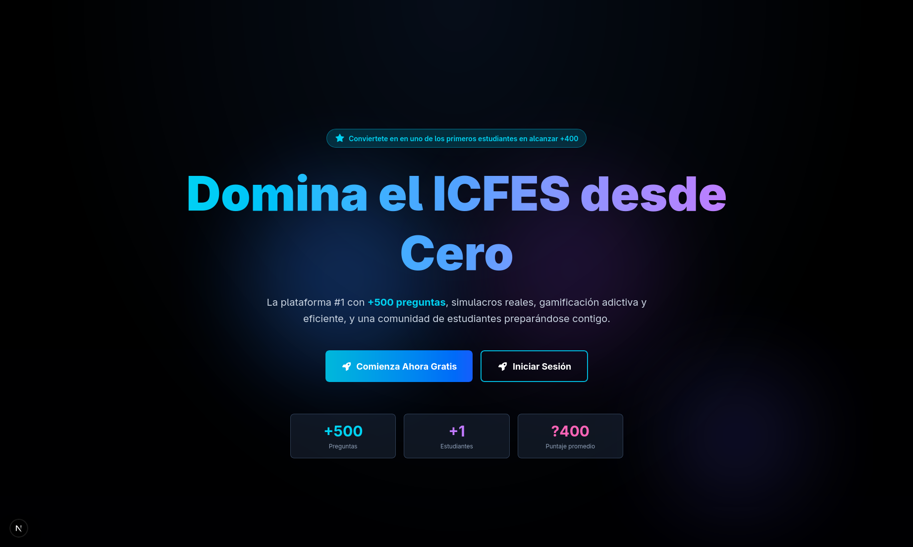

# Web Icfes Master

[English version](README.en.md)

Una plataforma interactiva para practicar preguntas y aprender temas del examen de estado ICFES (Saber 11) en colombia. Diseñada con arquitectura **Feature-Based** y **Atomic Design** usando Next.js 15, React 19, Tailwind CSS 3 y Supabase.

> se buscaba abarcar muchos mas paises, aparte de colombia, pero cada pais maneja la educacion de forma diferente, las preguntas, los temas, las materias cambian, incruso, hay paises donde el examen no es obligatorio o es inexistente.

---

## Temario

- [Web Icfes Master](#web-icfes-master)
  - [Temario](#temario)
  - [Características Principales](#características-principales)
  - [Contenido de Preguntas](#contenido-de-preguntas)
  - [Sistema de Logros](#sistema-de-logros)
    - [Categorías de Logros (40+ total)](#categorías-de-logros-40-total)
    - [Niveles y Experiencia](#niveles-y-experiencia)
  - [Despliegue](#despliegue)
  - [Documentación](#documentación)
    - [Visión General](#visión-general)
    - [Configuración](#configuración)
    - [Frontend](#frontend)
    - [Backend y Datos](#backend-y-datos)
    - [Integraciones](#integraciones)
  - [Requisitos para Contribuir](#requisitos-para-contribuir)
  - [Contacto](#contacto)

---

## Características Principales

> Mayormente implementado. Sin embargo, algunas características no están completamente implementadas.

- **3 Niveles de Aprendizaje**:
  - **Nivel Fácil**: Aprende bases con materiales estructurados y ejercicios básicos
  - **Nivel Intermedio**: Practica exámenes individuales por materia
  - **Nivel Avanzado**: Simulacro global ICFES de 200 preguntas en 3 horas

- **Práctica por Áreas**: Matemáticas, Lenguaje, Ciencias Naturales, Ciencias Sociales e Inglés
- **Examen Simulado Completo**: Resuelve todas las preguntas con temporizador configurable
- **Material de Estudio Avanzado**: Acceso a recursos educativos organizados por tema
- **Seguimiento de Progreso**: Visualiza tus estadísticas y áreas de mejora
- **Desafíos Diarios y Clasificatoria**: Compite y mantén rachas de estudio
- **Autenticación**: Inicio de sesión con email/contraseña y Google (Supabase Auth)
- **Sistema de Gamificación**: 40+ logros desbloqueables por categoría (Primeros Pasos, Rachas, Logros Académicos, Excelencia, Planes)
- **Planes de Suscripción**: Gratuito, Pro, Premium y Anual con beneficios progresivos
- **Sistema de Calificación**: Retroalimentación inmediata con explicaciones detalladas
- **Interfaz Responsiva**: Funciona perfectamente en móvil, tablet y desktop
- **Contenido Multimedia**: Soporta imágenes, tablas, fórmulas, gráficas y más

---

## Contenido de Preguntas

> No implementado completamente.

- **Matemáticas**: Álgebra, Geometría, Cálculo, Estadística
- **Lenguaje**: Gramática, Vocabulario, Comprensión, Literatura
- **Ciencias Naturales**: Biología, Física, Química, Ecología
- **Ciencias Sociales**: Historia, Geografía, Economía, Política
- **Inglés**: Vocabulario, Gramática, Comprensión de Lectura

Total: 40+ preguntas con contenido avanzado (imágenes, tablas, fórmulas, gráficas)

---

## Sistema de Logros

> Lógica aun no implementado.

### Categorías de Logros (40+ total)

1. **Primeros Pasos** (4 logros)
   - Primer Paso, Aprendiz, Perfeccionista Primerizo, Racha Inicial

2. **Rachas** (4 logros)
   - Semana de Fuego, Campeón Mensual, Leyenda de Rachas, Dedicado por un Año

3. **Logros Académicos** (8 logros)
   - Estudiante Dedicado, Maestro de Pruebas, Centinela del Conocimiento
   - Precisión, Impecable, Virtuoso

4. **Excelencia** (4 logros)
   - Excelencia, Maestro Integral, Rayo Veloz, Campeón de Consistencia

5. **Planes y Suscripciones** (16 logros)
   - Plan Gratuito: Usuario Gratuito, Explorador
   - Plan Pro: Usuario Pro, Poder Pro, Pro Avanzado
   - Plan Premium: Usuario Premium, Élite Premium, Maestría Premium, Centinela Premium
   - Plan Anual: Suscriptor Anual, Compromiso Anual, Leyenda Anual, Aprendiz de Vida

### Niveles y Experiencia

- Sistema de niveles progresivos basado en XP
- Desbloqueables según planes y actividad del usuario
- Visualización de progreso hacia el siguiente nivel

---

## Despliegue

La aplicación está configurada para su despliegue en CubePath, con la configuración adecuada en el servidor. Se utiliza Nginx como intermediario (proxy inverso) y una URL obtenida mediante DuckDNS. Además, el despliegue del servidor se gestiona utilizando npm y PM2.

---

## Documentación

Carpeta: `docs/es/`

### Visión General

- [**overview/README.md**](docs/es/overview/README.md) — Índice de la documentación
- [**overview/executive-summary.md**](docs/es/overview/executive-summary.md) — Resumen ejecutivo para managers y nuevos integrantes
- [**overview/project-structure.md**](docs/es/overview/project-structure.md) — Estructura de carpetas y arquitectura del proyecto

### Configuración

- [**setup/installation.md**](docs/es/setup/installation.md) — Instalación paso a paso del entorno local
- [**setup/configuration.md**](docs/es/setup/configuration.md) — Variables de entorno y archivos de configuración
- [**setup/technologies.md**](docs/es/setup/technologies.md) — Stack tecnológico (Next.js, React, Tailwind, etc.)
- [**setup/rutes.md**](docs/es/setup/rutes.md) — URLs y rutas de la aplicación
- [**setup/scripts.md**](docs/es/setup/scripts.md) — Comandos de package.json (dev, build, lint, etc.)
- [**setup/cheatsheet.md**](docs/es/setup/cheatsheet.md) — Comandos rápidos y snippets de uso frecuente

### Frontend

- [**frontend/architecture.md**](docs/es/frontend/architecture.md) — Arquitectura Feature-Based con Next.js
- [**frontend/components-guide.md**](docs/es/frontend/components-guide.md) — Uso de Hooks y creación de componentes
- [**frontend/styles-guide.md**](docs/es/frontend/styles-guide.md) — Sistema de diseño y Tailwind CSS

### Backend y Datos

- **Supabase** — Base de datos y autenticación
- [**backend/services-api.md**](docs/es/backend/services-api.md) — API de servicios, arquitectura Supabase y capa de datos
- [**data/learning-structure-guide.md**](docs/es/data/learning-structure-guide.md) — Estructura de datos del módulo de aprendizaje (tabla `learning_content`)

### Integraciones

- [**integrations/payments.md**](docs/es/integrations/payments.md) — Integración de pagos (PricingPlans, PaymentModal, Supabase)

---

## Requisitos para Contribuir

1. Fork el repositorio
2. Crea una rama para tu feature (`git checkout -b feature/AmazingFeature`)
3. Commit tus cambios (`git commit -m 'Add some AmazingFeature'`)
4. Push a la rama (`git push origin feature/AmazingFeature`)
5. Abre un Pull Request

---

## Contacto

Para sugerencias o reporte de errores, crea un issue en el repositorio de GitHub.

---

**Desarrollo:** Fravelz

**Licencia:** Apache License 2.0
