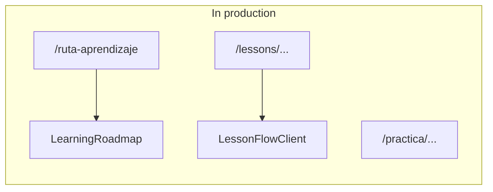

# Redundancy cleanup (reference)

Summary of the state after removing duplicate or unused code. Update when adding pages or services.

## Routes

- Home is only defined in `src/app/page.tsx` (duplicate `app/(auth)/page.tsx` was removed).
- `/aprendizaje` redirects to `/ruta-aprendizaje` (see `next.config.ts`). Lesson links use `/ruta-aprendizaje`.

## Active vs removed flow

## Services

The `src/services/index.ts` barrel exports plans, persistence, and gamification constants. Legacy re-export-only services were removed.

## Checklist before deleting code

1. `grep -r "SymbolName" src`
2. `npm run build`
