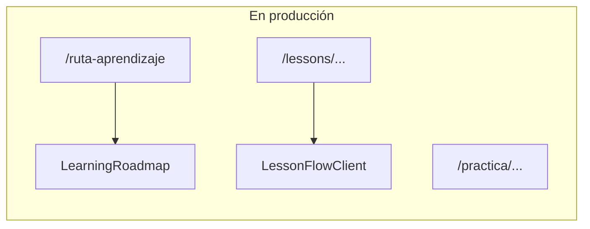

# Limpieza de redundancias (referencia)

Este documento resume el estado tras ordenar código duplicado o sin uso. Actualizar si se vuelve a añadir páginas o servicios.

## Rutas

- La home vive solo en `src/app/page.tsx` (se eliminó el duplicado bajo `app/(auth)/page.tsx`).
- `/aprendizaje` redirige a `/ruta-aprendizaje` (ver `next.config.ts`). Los enlaces en lecciones apuntan a `/ruta-aprendizaje`.

## Flujo activo vs retirado

## Servicios

El barrel `src/services/index.ts` exporta planes, persistencia y constantes de logros. Servicios que solo existían como reexport sin consumidores fueron eliminados (por ejemplo capas legacy de exam/logros/learning no usadas).

## Checklist al borrar código

1. `grep -r "NombreSimbolo" src`
2. `npm run build`
